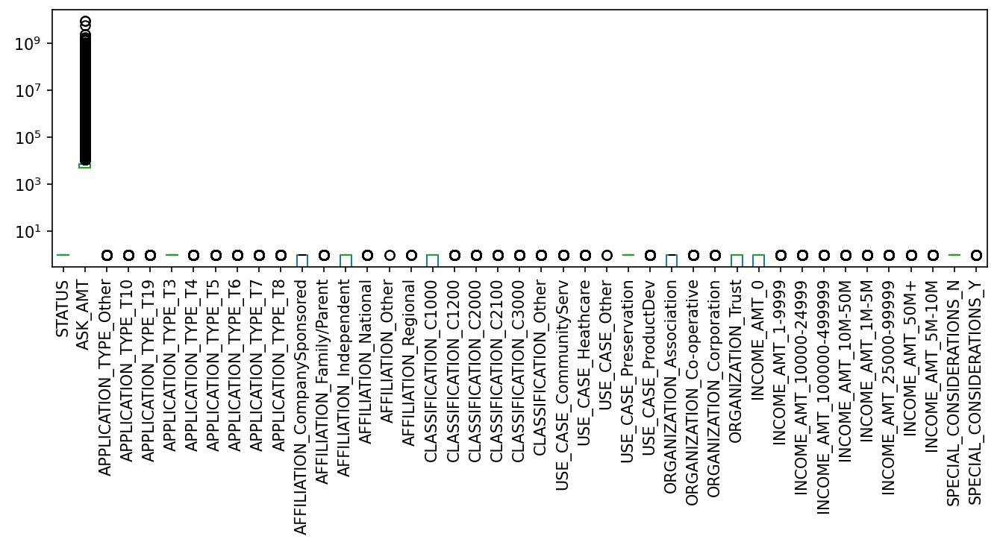

# Neural_Network_Charity_Analysis

## 1. Overview of the analysis

The purpose of this analysis is to predict the success of applicants that have received funding from Alphabet Soup. This is carried out through first pre-processing the data in preparation for training a neural network machine learning model to make binary predictions on applicant success. Following training, the neural network model predictive performance is evaluated by testing for predictive accuracy.

## 2. Results

* Data pre-processing:

  * After initial pre-processing, the data is split into predictor and response variables. For the purposes of this analysis, the response (target) variable is the IS_SUCCESSFUL column.
  * All remaining variables contained in the dataset are initially utilized as predictor features outside of those mentioned in the below bullet.
  * The EIN and NAME variables contained in the original dataset were neither predictor nor response/target variables and were therefore removed.

* Compiling, training, and evaluating the model

  * For the initial model, 2 hidden layers were selected to enable deep learning, with 80 neurons in the first hidden layer (roughly double the number of features), and 30 in the second layer (roughly the number of features). In the hidden layers, the relu activation function was utilized to identify any non-linear characteristics in the input data. For the output layer, a sigmoid activation function was utilized to predict the probability that an application was successful.

  * Following the initial model construction and training, model optimization was performed in an attempt to achieve a predictive accuracy of 0.75. After 3 separate attempts, this level of accuracy was not achieved, though the accuracy of the original model was improved slightly.

  * Optimization steps taken included evaluating the input data to remove noisy input features with many outliers (as shown below), re-defining the neural network model architecture to increase the number of neurons, utilizing different hidden layer activation functions, and training for more epochs.

    

## 3. Summary

Overall,

